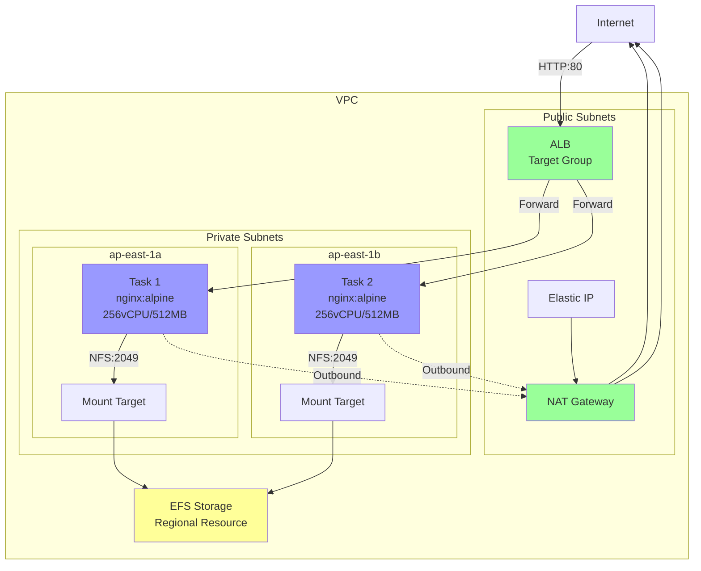
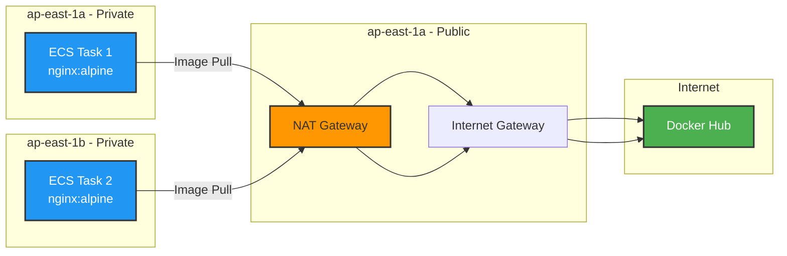
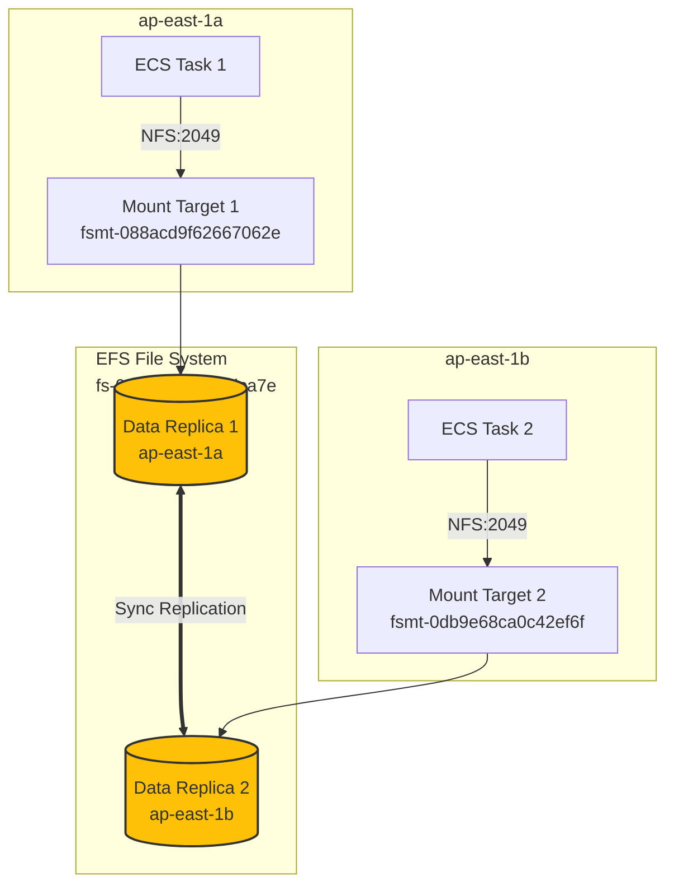
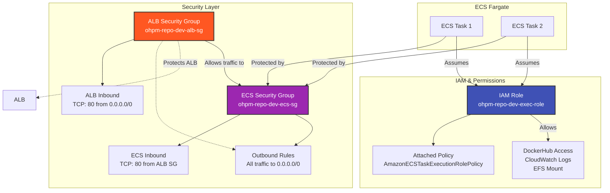
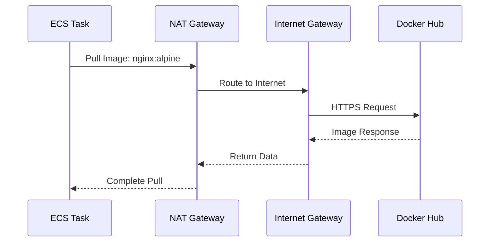
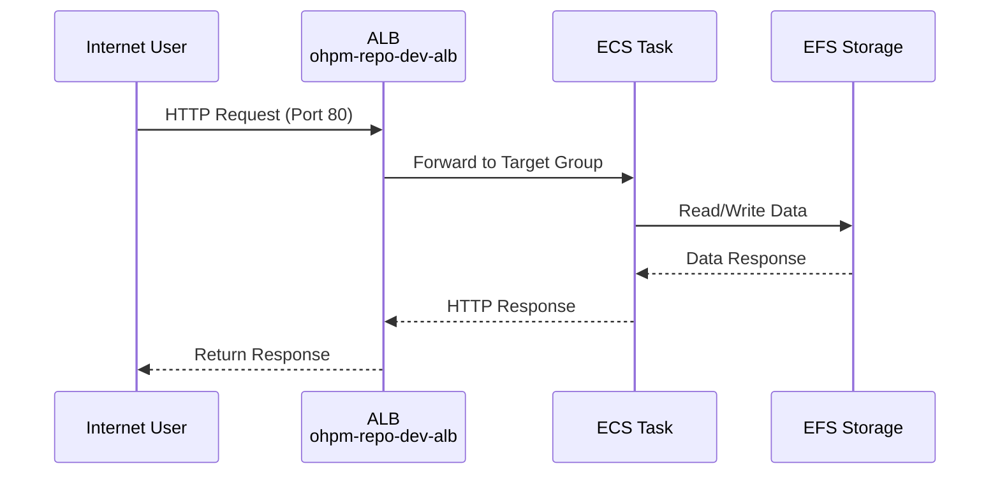

# AWS Architecture - OHPM Repo Deployment

## Current Architecture Overview

## Network Architecture

## EFS Multi-AZ Storage

## Security & IAM

## Component Details

### Network Layer
| Component | ID/Name | AZ | Purpose |
|-----------|---------|-----|---------|
| Public Subnet 1 | subnet-03b0f61a5d80d03e1 | ap-east-1a | NAT Gateway placement |
| Public Subnet 2 | subnet-0ac9b826ce0116170 | ap-east-1b | Reserved for HA |
| Private Subnet 1 | subnet-09fa9fb721383b4be | ap-east-1a | ECS tasks + EFS mount |
| Private Subnet 2 | subnet-0f95c02c7443c1db2 | ap-east-1b | ECS tasks + EFS mount |
| NAT Gateway | nat-0182cc0f1f3275ffb | ap-east-1a | Outbound internet access |
| Elastic IP | eip-alloc-xxx | ap-east-1a | NAT Gateway public IP |

### Compute Layer
| Component | ID/Name | Configuration |
|-----------|---------|---------------|
| ECS Cluster | ohpm-repo-dev-cluster | Fargate launch type |
| ECS Service | ohpm-repo-dev-service | Desired: 2 tasks |
| ECS Task 1 | arn:aws:ecs:ap-east-1:xxx:task/xxx | nginx:alpine (Docker Hub) |
| ECS Task 2 | arn:aws:ecs:ap-east-1:xxx:task/xxx | nginx:alpine (Docker Hub) |
| Task Definition | ohpm-repo-dev-task | 256 vCPU, 512MB RAM |

### Storage Layer
| Component | ID/Name | Location |
|-----------|---------|----------|
| EFS File System | fs-058f67104d63dca7e | Multi-AZ (regional) |
| EFS Mount Target 1 | fsmt-088acd9f62667062e | ap-east-1a (private subnet) |
| EFS Mount Target 2 | fsmt-0db9e68ca0c42ef6f | ap-east-1b (private subnet) |

### Security & IAM
| Component | ID/Name | Purpose |
|-----------|---------|---------|
| ALB Security Group | ohpm-repo-dev-alb-sg | Inbound: TCP 80 from internet |
| ECS Security Group | ohpm-repo-dev-ecs-sg | Inbound: TCP 80 from ALB SG only |
| IAM Role | ohpm-repo-dev-exec-role | ECS task execution role |

## Traffic Flow

### Outbound Traffic (Working)

### Inbound Traffic (Working)

**Status**: ALB deployed and functional. Traffic flows from internet → ALB → ECS tasks → EFS storage.

## Cost Considerations

| Service | Monthly Cost (Approx) | Free Tier |
|---------|---------------------|-----------|
| ALB (Application Load Balancer) | ~$0.025/hour = ~$18/month | Not covered |
| ALB LCU (Load Balancer Capacity Units) | ~$0.008/LCU-hour | Not covered |
| NAT Gateway | ~$32.00 | Not covered |
| EIP | ~$2.50 | Not covered |
| EFS | ~$0.30/GB-Month | Covered (First 5GB) |
| ECS Fargate | ~$8.00 | Partially covered (750 hrs/mo) |
| NAT Gateway Data Processing | ~$0.045/GB | Not covered |

## Next Steps

1. ~~**Apply for ALB quota**~~ - ✅ Completed
2. ~~**Add ALB**~~ - ✅ Deployed
3. **Configure HTTPS** - Add SSL certificate and HTTPS listener
4. **Configure Route 53** - Set up custom domain name
5. **Deploy OHPM repo** - Replace nginx with actual OHPM repository application

## Terraform Resources

All resources are managed via Terraform:
- `main.tf` - Infrastructure definitions
- `variables.tf` - Variable declarations
- `dev.tfvars` - Development environment values
- `outputs.tf` - Output values

## Notes

- **ALB**: Public load balancer distributing traffic to ECS tasks across AZs
- **NAT Gateway**: Required for ECS tasks in private subnets to access Docker Hub
- **EFS**: Multi-AZ storage with automatic replication
- **Docker Hub**: Currently testing NAT Gateway connectivity with `nginx:alpine`
- **Security**: ECS tasks have no public IP (assign_public_ip = false), only accessible via ALB
- **Security Groups**: ECS security group only allows traffic from ALB security group, enhancing security
